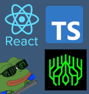
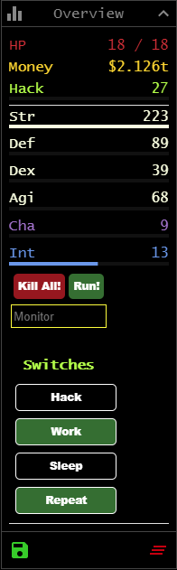

<p align="center">
    
</p>

# Bitburner Custom UI with React Example


Did you know you could use React to create custom UI components with access to netscript?

Turns out it's pretty simple since React and ReactDOM are already present in `Window` object of Bitburner.


## Getting Started

### Prerequisites

1. Use an IDE with ability to sync files to Bitburner
   - There is a great extension available for VSCode which can be found [here](https://marketplace.visualstudio.com/items?itemName=bitburner.bitburner-vscode-integration)

2. Run the game

2. **Backup your save**

### Installation

1. Clone the repo and install packages
```sh
git clone https://github.com/oddiz/bitburner-react-ui-example.git
cd bitburner-react-ui-example
npm i
```
2. Enter your Bitburner API key inside `.vscode/settings.json`
```json
"bitburner.authToken": "YourAPIKeyHere"
```
3. Run build `npm run build`
   - If you want automatic build on file change use `npm run dev` 
  
  

## Usage 

If build step was sucessful and vscode bitburner extension is enabled you should now have `ui-example` folder in game. 

Run `ui.js` from terminal:

```sh
run ui-example/ui.js
```


## Things to consider

- Imports must be done with full path with a `/` at start in order for Bitburner to find. 
```js
import { Button } from "/ui-example/components/Button";
``` 

- UI doesn't disappear if you kill `ui.js`. However using it without running the script will very likely cause errors. 

## Contact
If you still have questions you can message me on discord

oddiz#9659

